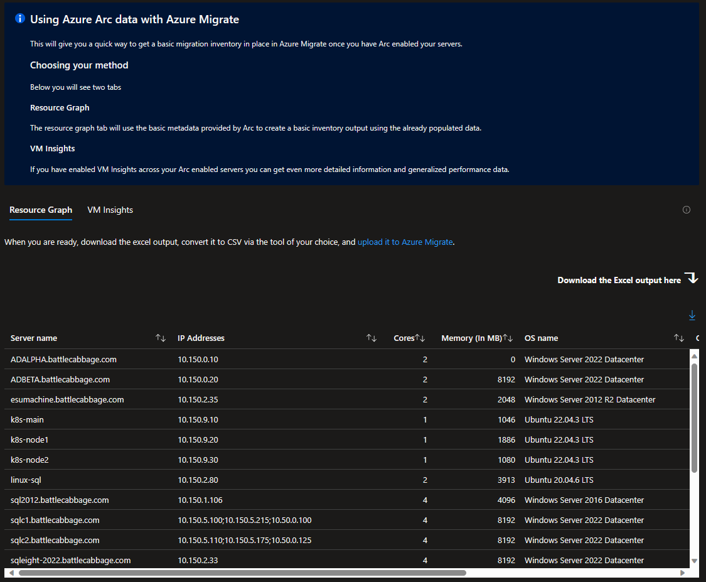

# arc-to-azure-migrate-workbook
An Azure Monitor workbook to export Arc data into a format usable by Azure Migrate

## How to Use

Once you have deployed the workbook with the button above you can select either the **Resource Graph** or **VM Insights** tab based on which data source you would like to use.

### Resource Graph

This uses the free, built-in data provided by Arc Enabling your servers. This will create a basic inventory to be used in Azure Migrate but will not have any performance sizing data available.

### VM Insights

If you have enabled VM Insights across your servers you can build a more indepth inventory with performance data based on the log analytics output.

#### Extra settings

If you are using VM Insights you can select which Log Analytics workspace to query, what time frame you would like your statistics calculated with, and for the percentile based pane, which percentile you'd like to calculate.

When using this the VM Insights output you can also decide if you would like to use the Average performance over the time frame, the selected percentile, or the max used resources. 

## Integrating the information into Azure Migrate

To use the data provided. Download the excel output by clicking the Download arrow in the upper right hand corner of the table. Then convert that excel file to CSV via whichever tooling you prefer. Once you have it in the CSV format you can [upload the information to Azure Migrate](https://learn.microsoft.com/en-us/azure/migrate/tutorial-discover-import#import-the-server-information) and start exploring your data. 